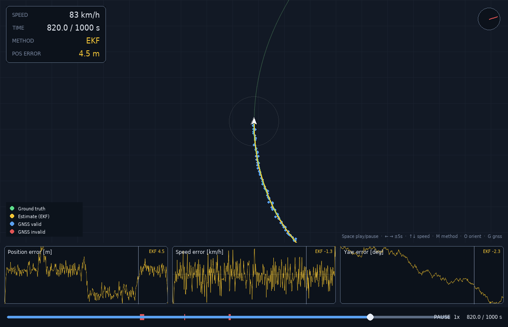
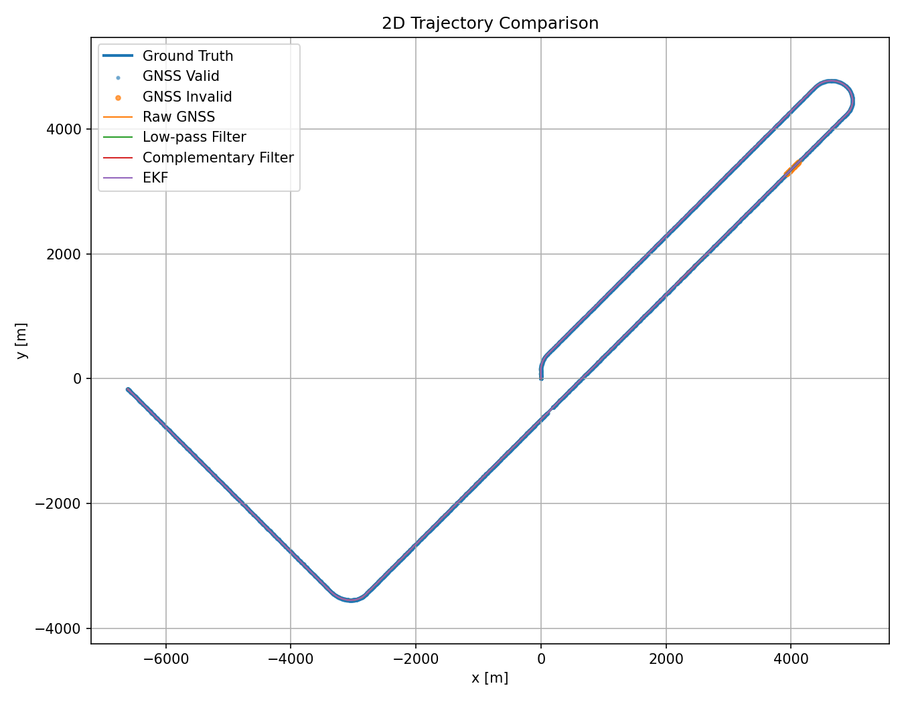
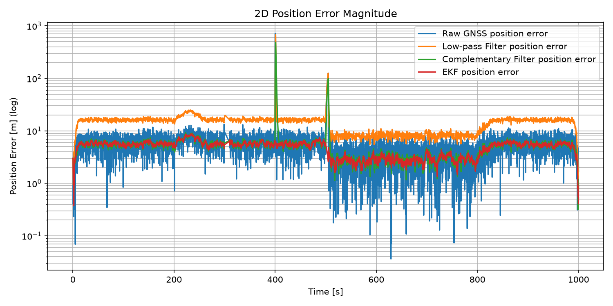
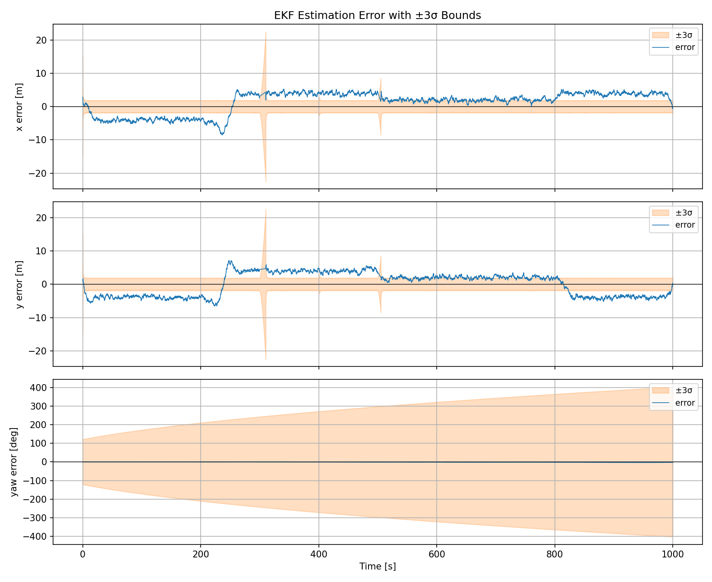
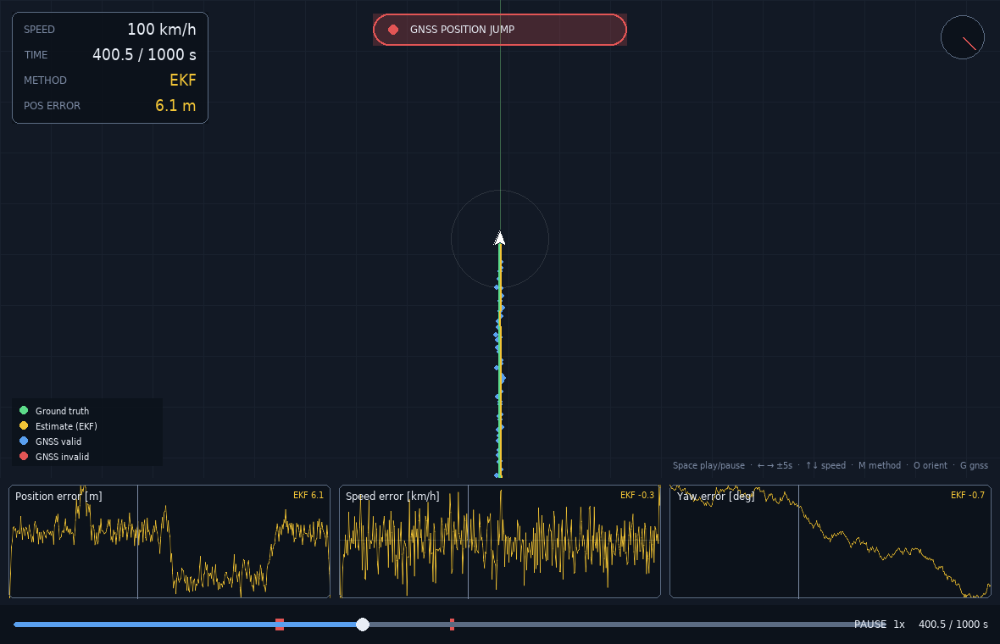

# IMU–GNSS Tabanlı 2B Araç Durum Kestirimi

IMU ve GNSS sensörlerini kullanarak iki boyutlu düzlemde hareket eden bir aracın
**konum, hız ve yönelim** durumlarını kestiren, **modüler ve config-driven** bir
Python simülasyonu. Proje; gerçek araç hareketini üretir, bu hareketten gürültülü
sensör ölçümleri ve GNSS arızaları simüle eder, IMU kalibrasyonu uygular, farklı
filtreleme yöntemlerini karşılaştırır ve sonuçları grafikler, RMSE tablosu ve canlı
bir minimap arayüzü üzerinden sunar.

<p align="center">
  
</p>

> Tahmin edilen durum vektörü: **x, y, vₓ, v_y, ψ** &nbsp;·&nbsp; Sensörler: **IMU + GNSS**
> &nbsp;·&nbsp; Yöntemler: **Ham GNSS · Alçak Geçiren · Tamamlayıcı · EKF**

---

## Genel Bakış

Araç 2B yatay düzlemde hareket eder. Önce gerçek (gürültüsüz) hareket verilen rota
senaryosundan üretilir; ardından bu hareketten IMU (ivmeölçer + jiroskop) ve GNSS
(konum + hız) ölçümleri türetilir. Sensörlere gürültü, bias, ölçek faktörü, gecikme
ve arıza senaryoları eklenir. IMU kalibre edilir ve dört farklı füzyon yöntemiyle
gerçek harekete en yakın kestirim yapılmaya çalışılır.

Tüm parametreler — simülasyon süresi, frekanslar, rota segmentleri, sensör
gürültüleri, bias/scale değerleri, GNSS gecikmesi, arıza senaryoları, filtre
katsayıları ve GUI ayarları — koda gömülü değildir; tamamı `config.yaml`'dan okunur.

## Özellikler

- Rota senaryosundan **gerçek araç yörüngesi** üretimi (kinematik nokta-kütle modeli)
- **IMU modeli**: ivme `aₓ, a_y` ve jiroskop yaw-rate — gürültü, bias, ölçek faktörü
- **GNSS modeli**: `x, y, vₓ, v_y` — ölçüm gürültüsü ve 200 ms gecikme
- **GNSS arıza senaryoları**: veri kesilmesi (300–310 s), 500 m pozisyon sıçraması
  (400–401 s), donmuş veri (500–505 s)
- **Veriden kestirilen IMU kalibrasyonu** (sabit-hız penceresinden bias tahmini —
  gerçek değerler kullanılmaz)
- **Dört yöntem**: Ham GNSS · Alçak Geçiren Filtre · Tamamlayıcı Filtre (dropout'ta
  IMU dead-reckoning) · **EKF** (innovation gating ile arıza/aykırı değer reddi)
- Konum, hız ve yaw için **RMSE metrikleri** + **EKF kovaryansı ve ±3σ** grafikleri
- **Config-driven, GTA tarzı canlı minimap GUI** (Pygame)

## Proje Yapısı

```text
imu-gnss-2d-state-estimation/
├── main.py                 # tüm pipeline'ı sırayla çalıştırır
├── config.yaml             # tüm parametreler (simülasyon, sensör, arıza, filtre, gui)
├── run_gui.py              # minimap GUI giriş noktası
├── requirements.txt
├── src/                    # simülasyon çekirdeği
│   ├── config_loader.py    #   config okuma + doğrulama
│   ├── route_generator.py  #   gerçek hareket üretimi
│   ├── sensor_models.py    #   IMU + GNSS ölçüm modelleri
│   ├── faults.py           #   GNSS gecikme + arıza senaryoları
│   ├── calibration.py      #   veriden bias kestirimli kalibrasyon
│   ├── filters.py          #   Raw / AGF / Tamamlayıcı / EKF
│   ├── metrics.py          #   RMSE hesapları
│   └── plotting.py         #   tüm grafikler
├── gui/                    # bağımsız Pygame minimap arayüzü
│   ├── data_loader.py · camera.py · minimap.py
│   ├── charts.py · hud.py · timeline.py · playback.py · app.py
├── outputs/
│   ├── plots/              # üretilen grafikler (.png)
│   └── data/               # rmse_table.csv, timeseries.npz
└── report/                 # PDF rapor
```

## Kurulum

```bash
python -m pip install -r requirements.txt
```

## Kullanım

```bash
python main.py      # simülasyonu çalıştırır; grafikleri ve timeseries.npz'i üretir
python run_gui.py   # minimap arayüzünü açar (önce main.py çalıştırılmalı)
```

`main.py`; config'i yükler, gerçek hareketi üretir, sensör ölçümlerini ve arızaları
oluşturur, kalibrasyon ve filtreleri uygular, RMSE tablosunu hesaplar ve tüm
grafikleri `outputs/` altına yazar.

## Sonuçlar

Yöntemlerin gerçek harekete göre RMSE değerleri (düşük = iyi):

| Yöntem | Konum RMSE [m] | Hız RMSE [m/s] | Yaw RMSE [°] |
|---|:--:|:--:|:--:|
| Ham GNSS | 25.18 | 0.697 | 1.289 |
| Alçak Geçiren Filtre | 26.01 | 0.683 | 1.039 |
| Tamamlayıcı Filtre | 17.48 | 0.411 | 1.688 |
| **EKF** | **5.01** | **0.325** | **1.688** |

EKF konum ve hızda açık ara en başarılıdır; innovation gating sayesinde 500 m
pozisyon sıçramasını ve donmuş-veri arızasını **reddederek**, diğer yöntemlerin
sıçradığı anlarda hatayı düşük tutar. Yaw RMSE'si EKF ve Tamamlayıcı filtrede aynıdır:
GNSS yönelimi doğrudan ölçmediği için her ikisi de yaw'ı kalibre jiroskopla taşır.

<p align="center">
  
  
</p>
<p align="center">
  <em>Sol: 2B yörünge karşılaştırması &nbsp;·&nbsp; Sağ: 2B konum hatası (log ölçek) —
  EKF, 400 s ve 500 s arızalarında dipte kalır.</em>
</p>

EKF ayrıca her durum için bir belirsizlik (kovaryans) üretir. Yönelim belirsizliği
(σψ) sürekli büyür — GNSS yaw'ı gözlemlemediğinden yaw gözlemlenebilir değildir ve
bu, yaw kestirimindeki yavaş sürüklenmenin (drift) doğrudan açıklamasıdır.

<p align="center">
  
</p>
<p align="center">
  <em>EKF kestirim hatası ve ±3σ sınırları: konum hataları bant içinde kalır
  (filtre tutarlıdır).</em>
</p>

## Minimap GUI

Simülasyonu **GTA tarzı heading-up bir minimap** üzerinde yeniden oynatan,
config-driven bir Pygame arayüzü. Ana pipeline'dan tamamen bağımsızdır; yalnızca
`outputs/data/timeseries.npz`'i okur. Araç hep ekranın merkezinde ve yukarı bakar,
harita araç yönelimine göre döner.

İçerir: gerçek rota, seçili filtre izi ve GNSS noktaları (geçersizler kırmızı); bir
HUD (hız, zaman, yöntem, anlık konum hatası); arıza anlarında ekran uyarısı;
ileri-geri sarılabilen medya-oynatıcı zaman çizgisi; ve oynatma kafasıyla senkron
**canlı hata şeritleri** (konum, hız, yaw hatası). `M` ile aktif yöntem değişir; harita
ve şeritler o yöntemin kimlik rengine geçer.

<p align="center">
  
</p>
<p align="center">
  <em>400 s GNSS pozisyon sıçraması anı: ekranda arıza uyarısı, EKF arızayı reddediyor.</em>
</p>

**Kontroller:** `Boşluk` oynat/duraklat · `← →` ±5 s · `↑ ↓` hız · `M` yöntem değiştir ·
`O` heading-up/north-up · `G` GNSS katmanı · `T`/`E` gerçek rota/kestirim katmanı ·
zaman çizgisini sürükleyerek ileri-geri gez.

Pencere boyutu, renkler, zoom, iz uzunluğu, varsayılan yöntem, oynatma hızları ve
gösterilecek şeritler — hepsi `config.yaml`'daki `gui` bölümünden ayarlanır.

## Yöntemler

| Yöntem | Kısa açıklama |
|---|---|
| **Ham GNSS** | GNSS ölçümleri ana zamana interpole edilir (referans yöntem). |
| **Alçak Geçiren Filtre** | Birinci dereceden filtre; gürültüyü yumuşatır, faz gecikmesi getirir. |
| **Tamamlayıcı Filtre** | IMU kısa vade, GNSS uzun vade; dropout'ta saf IMU dead-reckoning. |
| **EKF** | IMU öngörü + GNSS güncelleme; innovation gating ile arıza reddi. |

## Varsayımlar ve Konvansiyonlar

- Koordinat sistemi: x = doğu, y = kuzey; yaw ψ pozitif y yönünde 90°; saat yönünün
  tersi pozitif (sağ dönüşler negatif).
- Hız geçişlerinde sabit boylamsal ivme, dönüşlerde sabit yaw-rate varsayımı.
- Araç noktasal kütle kinematik modeliyle temsil edilir.
- IMU ivmeleri global çerçevede modellenmiştir.
- Tekrarlanabilirlik için sabit `random_seed`.

## Üretilen Çıktılar

`outputs/plots/` altındaki grafikler: `true_trajectory`, `trajectory_comparison`,
`x_position_error`, `y_position_error`, `position_error_magnitude`,
`speed_comparison`, `velocity_components`, `yaw_comparison`, `gnss_fault_scenarios`,
`imu_ax_calibration`, `imu_ay_calibration`, `gyro_calibration`, `ekf_covariance`,
`ekf_error_3sigma`.

RMSE metrikleri `outputs/data/rmse_table.csv`'ye; ayrıntılı PDF rapor `report/`
klasörüne yazılır.
